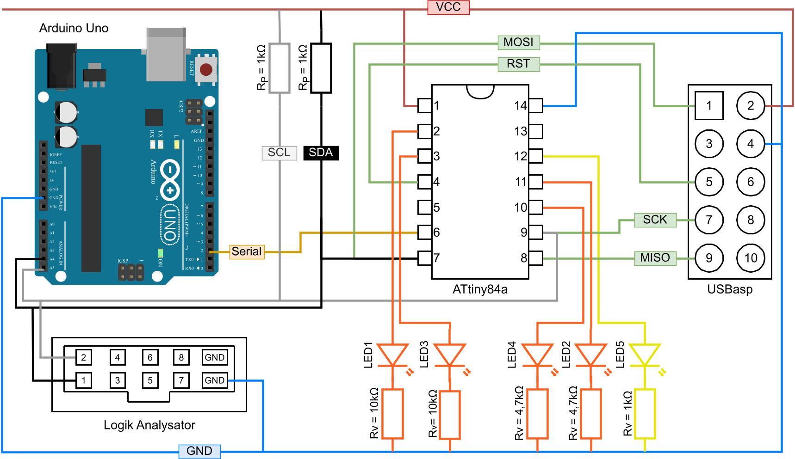

# AquaI/O Firmware  

## Overview  
This firmware runs on the AquaI/O board, part of the Aquasonic 3 rocket project. It manages parachute deployment using I²C communication, precise timing, and GPIO control. Designed for ATtiny84a, the system follows a modular architecture for flexibility and maintainability.  

## Features  
- Parachute deployment via configurable timing windows.  
- I²C slave communication for remote control.  
- Modular structure for easy updates and extensions.  
- Debugging support with conditional logging.  

## Setup  
1. Make sure you have installed Visual Studio Code and PlatformIO
2. Clone the repository
3. Open the project in Visual Studio Code.
4. Connect the ATtiny84a as shown in the following pinout diagram

## Pinout Diagram

## About Aquasonic
Aquasonic 3 is the third rocket project by Hochschule Bremen, conducted as part of the STERN program (Student Experimental Rockets) of the German Aerospace Center (DLR). The goal of this project is to design and build a functional sounding rocket.

Within the Aquasonic 3 project, the Aquasonic Avionics subproject focuses on developing and integrating the rocket's avionics systems. These systems are responsible for electronic control, data processing, and communication interfaces for the rocket.
